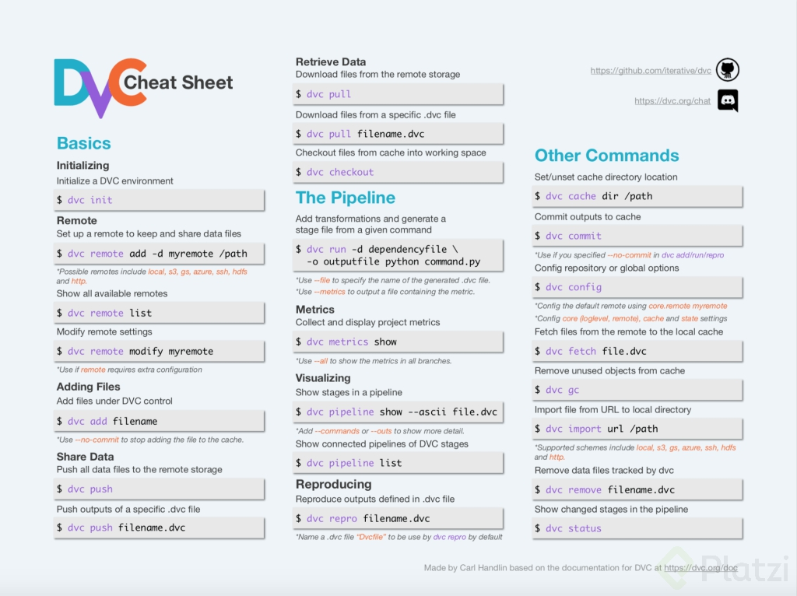

## DVC (Data Version Control)

*DVC* es una herramienta de código abierto utilizada para el control de versiones de datos y modelos en proyectos de aprendizaje automático (*ML*). A diferencia de las herramientas tradicionales de control de versiones como *Git*, que están diseñadas principalmente para el código fuente, *DVC* se enfoca en el control de versiones de activos de datos y modelos, lo que lo hace especialmente útil en el contexto de proyectos de aprendizaje automático.

Las características clave de *DVC* incluyen:

1. **Control de versiones de datos:** *DVC* permite rastrear y versionar conjuntos de datos, lo que facilita la reproducción de experimentos de *ML* y el seguimiento de los cambios en los datos a lo largo del tiempo.

2. **Gestión de modelos:** Puedes utilizar *DVC* para versionar modelos, lo que te permite controlar las diferencias entre modelos entrenados en diferentes momentos o con diferentes conjuntos de datos.

3. **Almacenamiento de datos en caché:** *DVC* almacena datos y modelos en caché de manera eficiente, lo que significa que no es necesario almacenar duplicados de grandes conjuntos de datos en tu repositorio *Git*.

4. **Integración con Git:** *DVC* se integra estrechamente con *Git*, lo que facilita la colaboración en proyectos de aprendizaje automático en equipos y la administración de versiones de código y datos de manera coherente.

5. **Reproducibilidad:** *DVC* proporciona herramientas para garantizar la reproducibilidad en tus experimentos de *ML*, lo que significa que puedes recrear fácilmente experimentos anteriores con los mismos datos y modelos.

6. **Compatibilidad con múltiples plataformas de almacenamiento:** Puedes utilizar *DVC* con una variedad de sistemas de almacenamiento, como sistemas de archivos locales, *Azure*, *Amazon S3*, *Google Cloud Storage* y otros.

En resumen, *DVC* es una herramienta valiosa para la gestión de versiones de datos y modelos en proyectos de aprendizaje automático, lo que ayuda a los equipos de *ML* a mantener un registro de los cambios en los activos de datos y modelos, así como a garantizar la reproducibilidad de sus experimentos.

### Instalación

Para instalar *DVC* en tu máquina local, puedes utilizar el siguiente comando:

```bash
pip install dvc
```
Intalacion google storage
```bash
pip install dvc[gs]
```

Conectar con google storage
```bash
export GOOGLE_APPLICATION_CREDENTIALS="path/to/credentials.json"
```
Verificar que se conecto correctamente
```bash
echo $GOOGLE_APPLICATION_CREDENTIALS
```

conectar con el bucket
```bash
dvc remote add dataset-track gs://bucket-name/dvc-store
```

subir los archivos
```bash
dvc add dataset/file.csv --to-remote -r dataset-track
```

### Comandos básicos

