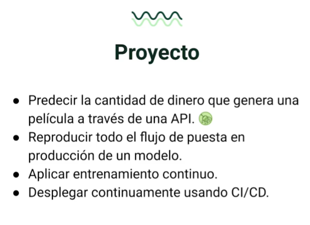
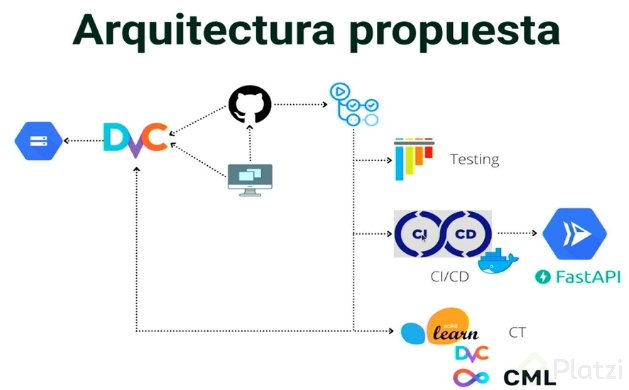

# Despliegue de modelos de Machine Learning en producción
## Introducción
En este repositorio se encuentra el código necesario para desplegar un modelo de Machine Learning en producción. El objetivo es predecir cantidad de dinero que genera una pelicula a traves de una API. 

¿En qué consiste el proyecto?

* Predecir la cantidad de dinero que genera una película a través de una API
* Reproducir todo el flujo de puesta en producción de un modelo
* Aplica entrenamiento continuo
* Desplegar continuamente usando CI/CD



## Arquitectura del proyecto
La arquitectura del proyecto es la siguiente:



se va a trabajar en *Github*, alli vammos a tener 3 activaciones, por medio de *Github actions*, se van a activar tres *workflows* diferentes:

1. **Testing:** se va a encargar de ejecutar los test unitarios, para verificar que el código que se está escribiendo es correcto.

2. **CI / CD:** se va a encargar de ejecutar el proceso de integración continua para *Docker* y despliegue continuo hasta *cloud Run* utilizando una *API* basada en *Fast API*.

3. **Reentrenamiento:** va a utilizar *Scikit learn* para reentrenar un modelo de *Machine Learning*, *Data Version Cotrol (DVC)* para versionar los datos y *Continue Machine Learning* para publicar las metricas de *performance* del modelo.

## Distribucion de archivos
- **dvc:** contiene los archivos de configuracion de [*DVC*](DVC.md)
- **github/workflows:** contiene los archivos de configuracion de *github actions*
- **api:** *API* basada en *Fast API*
- **dataset:** Archivos del dataset traqueados por *DVC*
- **model:** Archivos del modelo traqueados por *DVC*
- **notebooks:** Notebooks de *Jupyter* para el entrenamiento del modelo
- **src:** Archivos usados para reentrenamiento del modelo
- **utilities:** Archivos de utilidades especificos para el proyecto
- **Archivos miscelaneos:** *Dockerfile*

## Reentrenamiento del modelo
- **Prepare.py:** Recupera y prepara los datos para el entrenamiento del modelo.
- **Train.py:** Entrena el modelo y lo guarda en el directorio *model*, ademas de generar las metricas de *performance*.
- **utils.py:** Contiene funciones de utilidad para el proyecto.

### Aplicamos DVC para crear flujo de trabajo de reentrenamiento

#### Flujo de trabajo de reentrenamiento
En versiones anteriores de *DVC* se utilizaba el comando `dvc run` para crear un flujo de trabajo.  
- `-n` asigna un nombre al flujo de trabajo.  
- `label_name` es el nombre del flujo de trabajo.  
- `-o` asigna un archivo de salida.  
- `output` es el archivo de salida.  
- `script` es el script que se va a ejecutar.  

```bash	
dvc run -n <label_name> -o <output> python <script>
```

En versiones actuales de *DVC* se utiliza una estructura basada en `dvc.yaml` y etapas *DVC* (`dvc.yaml` y `dvc.lock`).

Se crea un archivo `dvc.yaml` en la raiz del proyecto, en el se definen las etapas de *DVC* que se van a ejecutar.
```yaml
stages:
  prepare: # nombre de la etapa
    cmd: python <script> # script que se va a ejecutar 
    deps: # archivos de entrada
      - <input>
    outs: # archivos de salida
      - <output>
  train: # nombre de la etapa
    cmd: python <script> # script que se va a ejecutar
    deps: # archivos de entrada
      - <input>
    outs: # archivos de salida
      - <output>
```
> Nota: DVC utiliza Git para rastrear cambios en los archivos de configuración, pero los datos y resultados generados por DVC deben ser gestionados exclusivamente por DVC para evitar conflictos.

 Para resolver este problema, debes detener el rastreo del archivo en Git
```bash
git rm -r  --cached <archivo>
```
confirma los cambios
```bash
git commit -m "stop tracking <archivo>"
```

#### Ejecutar flujo de trabajo de reentrenamiento
Una vez esta todo orquestado, por medio de *DVC* se ejecuta el flujo de trabajo de reentrenamiento.
```bash
dvc repro
```
forzar la ejecucion del flujo
```bash
dvc repro -f
```
ver los `dags` de *DVC*, estos son los flujos de trabajo que se han ejecutado.
```bash
dvc dag
```

## Despliegue de la API
Para crear la *API* lo hacemos bajo la siguiente estructura, dentro de una carpeta que nomabramos *api*:
- **main:** crea un servicio web (*app*) que puede recibir solicitudes POST en la ruta `"/v1/prediction"`, y cuando recibe una solicitud, utiliza la función `get_prediction` para realizar una predicción y devuelve la predicción como respuesta en un formato específico definido por `Prediction_Response`.
- **views:** Realizar una predicción con la funcion `get_prediction` utilizando un modelo de machine learning previamente cargado y un conjunto de datos proporcionados en la solicitud.
- **models:** Define dos clases `Prediction_Request` y `Prediction_Response` utilizando el módulo `pydantic`, que se utilizan para definir la estructura de los datos de entrada y salida para un servicio web.
- **utils:** Archivos de utilidades especificas de la *API*

Para ejecutar la *API* usamos el siguiente codigo
```bash
uvicorn api.main:app
```

## Testing
Para hacer el *testing* de la *API* lo hacemos bajo la siguiente estructura:
- **test_1:** Se utiliza para realizar pruebas (mediante funciones de prueba) en una API creada con FastAPI. Estas funciones de prueba se utilizan para verificar el comportamiento de tu API al recibir solicitudes con diferentes datos de entrada. Se aseguran de que la API responda correctamente y que los resultados sean coherentes con los datos de entrada proporcionados.  
> **Nota:** es mejor práctica llamar a los test con alguno de estos dos patrones: test_*.py o *_test.py. Así solo corriendo el comando `pytest` detectará todos los tests del proyecto.

ejecutar test
```bash
pytest # o pytest test_name.py
```

## Empaquetando *API* con *Docker*
Para crear la imagen *Docker* lo hacemos bajo la siguiente estructura
- **Dockerfile:** Archivo de configuracion de *Docker*
- **requirements.txt:** Archivo de dependencias de la *API*, se usan las de la *API*.
- **initializer.sh:** Archivo de inicializacion de la *API*

Para crear la imagen *Docker* ejecutamos el siguiente codigo
```bash
DOCKER_BUILDKIT=1 docker build . -t model-api:v1
```
> **Nota:** `DOCKER_BUILDKIT=1` es una variable de entorno que se utiliza para mejorar el rendimiento de la compilación de *Docker*, `model-api:v1` es el nombre de la imagen que se va a crear.

Para ejecutar la imagen *Docker* ejecutamos el siguiente codigo
```bash
docker run -p 8000:8000 model-api:v1
```

## Despliegue de la *API* en *Github Actions*
*Github Actions* es un servicio de integración continua que se puede utilizar para automatizar el flujo de trabajo de desarrollo de software. Se puede utilizar para compilar, probar y desplegar tu código cada vez que se realiza un cambio en el repositorio de código.

- **github/workflow:** contiene los archivos de configuracion de *github actions*
- **testing:** contiene la configuracion de *github actions* para el *testing* de la *API*
- **utilities/setter.py:** decodifica la clave de acceso a *Google cloud storage* para ser usada en el flujo de trabajo de *github actions*

### Credenciales
En este proyecto se utilizan credenciales para acceder a *Google cloud storage* y *Google cloud run*, para esto se utilizan *Github secrets*.

En *GCP* se crea un servicio de cuenta de servicio con los siguientes permisos:
- *Storage Admin*
- *Cloud Run Admin*
- *Artifact Registry Admin* 
- *Service Account User*

Se descarga el archivo *json* con las credenciales y se codifica en `base64` (esto porque no se pueden guardar archivos en *Github secrets*), para esto se utiliza el siguiente codigo
```bash
base64 <file>
```

Se crea un secreto en *Github* con el nombre `NAME_KEY` y se pega el resultado de la codificacion en `base64`.

> **Nota:** Una vez finalizado se debe hacer `push` al repositorio remoto.

## Entretenimiento continuo
Para el reentrenamiento continuo del modelo se utiliza *Github Actions* y *DVC*.

- **continuous_training:** contiene la configuracion de *github actions* para el reentrenamiento continuo del modelo.

Este flujo de trabajo automatiza el proceso de entrenamiento de un modelo de aprendizaje automático y su actualización periódica. También incluye la generación de informes y la publicación de métricas en el repositorio de GitHub. El flujo de trabajo se puede desencadenar tanto según una programación predefinida como de forma manual mediante la interfaz de GitHub Actions.

### Pasos aplicados en el flujo de trabajo
- **checkout:** descarga el repositorio de GitHub.
- **setup python:** configura el entorno de Python.
- **setup dvc:** configura el entorno de DVC.
- **get data:** descarga los datos de entrenamiento.
- **prepare data:** prepara los datos de entrenamiento.
- **train model:** entrena el modelo.
- **evaluate model:** evalua el modelo.
- **save model:** guarda el modelo.
- **save metrics:** guarda las metricas.
- **push metrics:** publica las metricas en el repositorio de GitHub.